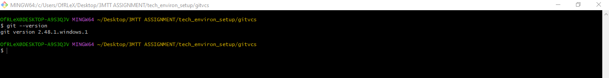
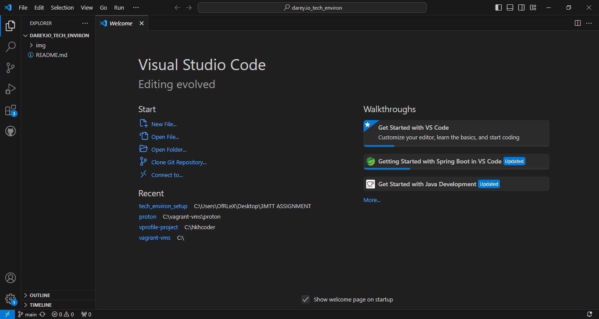
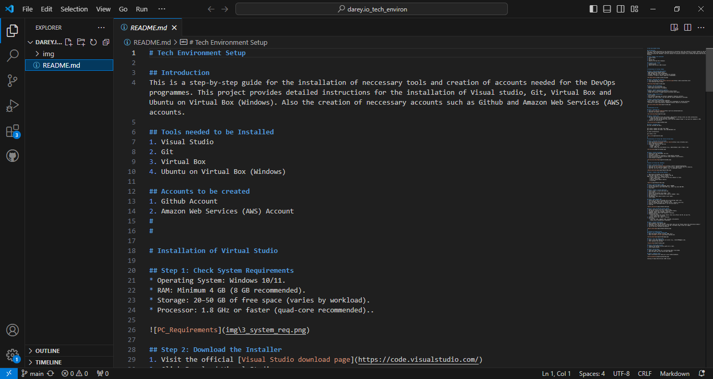
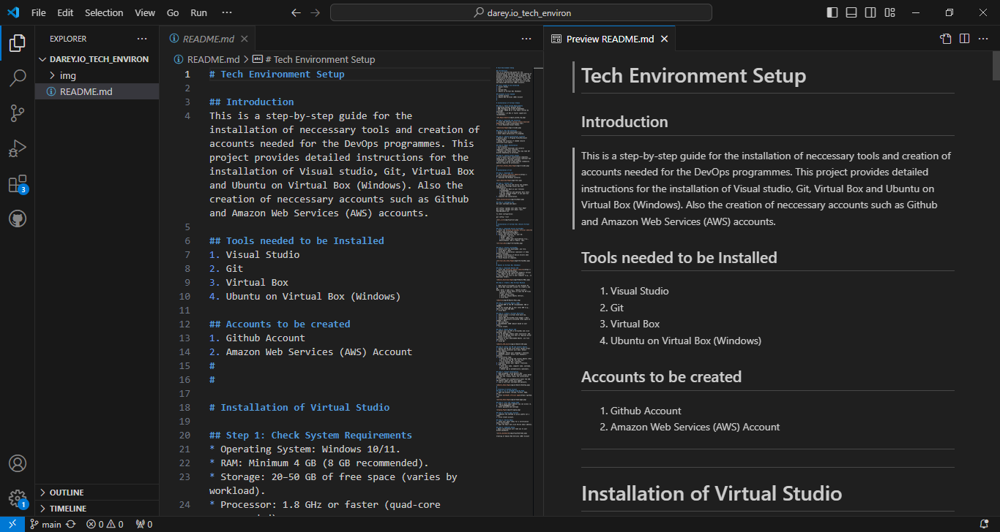
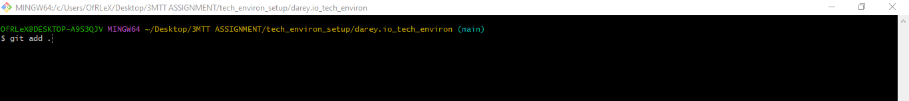
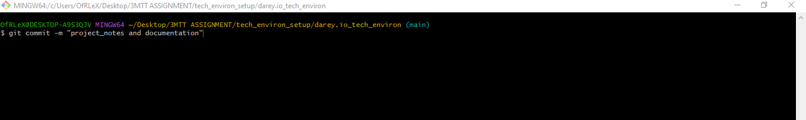
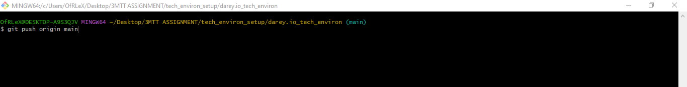
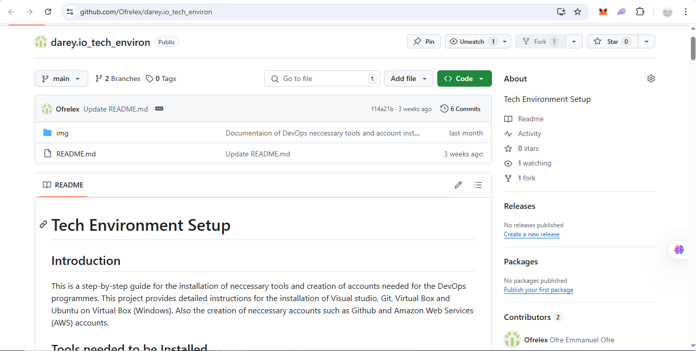

# Git AS A VERSION CONTROL SYSTEM

This project is to demonstrate the practical use of Git as a version control system in managing changes, tracking history, collaborating efficiently, and maintaining project consistency through a GitHub-hosted repository.
#
#
## Project Description
In this project, I used Git to manage the version history of a simple text-based project. The tasks involved initializing a Git repository, tracking changes, committing updates, and pushing the project to a remote repository on GitHub. This process highlights the efficiency and structure Git offers compared to manual version management.
#
#
## Tools Used
1. Git (Installed locally)
2. GitHub (Remote repository hosting)
3. GitBash (Terminal)
4. VS Code (Text Editor)
#
#
# Steps & Implementation
#
## Step 1: Verify Git Installation
```
git --version
```

#
## Step 2: Cloning the GitHub Repository
I cloned the repository to my local machine using the git clone command.
```
git clone https://github.com/Ofrelex/darey.io_tech_environ.git
```
## Step 3: Editing and Managing Files
I created and edited a README.md, documenting project updates, changes, and reflections.






## Step 4: Checking Git Status
Before committing, I used git status to identify untracked or modified files.
```
git status
```
## Step 5: Staging and Committing Files
After editing the project, I staged the files and committed the changes with descriptive messages.
```
git add .
git commit -m "Project_notes and Documentation"
```





## Step 6: Pushing Changes to GitHub
After committing, I pushed the updates to the remote GitHub repository.
```
git push origin main
```



#
#
## Viewing Changes on GitHub
The changes were visible in the repository on GitHub, including:
1. Commit history
2. File differences
3. Time of each update
#
#
## Key Learnings
1. Git makes version control structured and traceable.
2. Errors can be easily rolled back.
3. Collaborating is much easier with GitHub and branches.
4. Manual versioning is time-consuming and error-prone in comparison.
#
#
## Conclusion
Using Git as a version control system streamlines the software development process. It reduces errors, helps with collaboration, and offers powerful tools for managing code over time. This project demonstrated practical usage from cloning to committing and pushing code, reinforcing Git’s essential role in modern development workflows.